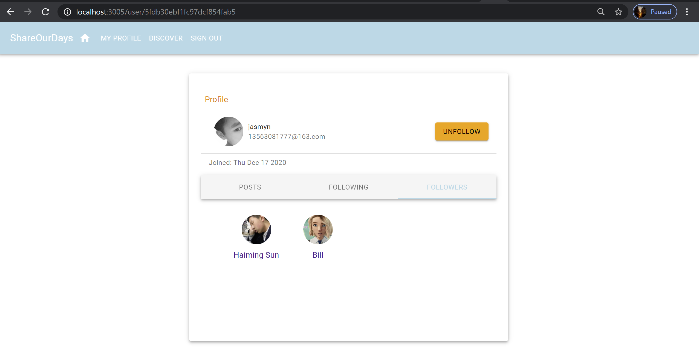

# ShareOurDays
 a web app for sharing thoughts with friends
### Introduction
The MERN stack which consists of **Mongo DB**, **Express.js**, **Node.js**, and **React.js** is a popular stack for building full-stack web-based applications because of its simplicity and ease of use. In recent years, with the explosive popularity and the growing maturity of the JavaScript ecosystem, the MERN stack has been the goto stack for a large number of web applications. This stack is also highly popular among newcomers to the JS field because of how easy it is to get started with this stack.
  
I built this repo sometime back whil learning the stack. 
  
This is a full-stack application that can be up and running with just a few steps. 
Its frontend is built with [Material UI](https://material-ui.com/) running on top of React.
The backend is built with Express.js and Node.js.
  
UI Screenshots

  

### What you need to run this code
  Node (13.12.0)
  NPM (6.14.4) or Yarn (1.22.4)
  MongoDB (4.2.0)
  

### How to run this code
Clone this repository and open command line in the cloned folder.
  
To install dependencies, run npm install or yarn.
  
Make sure you connects to MongoDB
  
To run the application for development, use npm run development
  
Open localhost:3005 in the browser
  
There you go!
